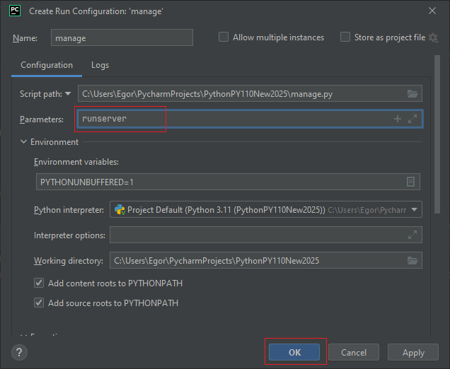
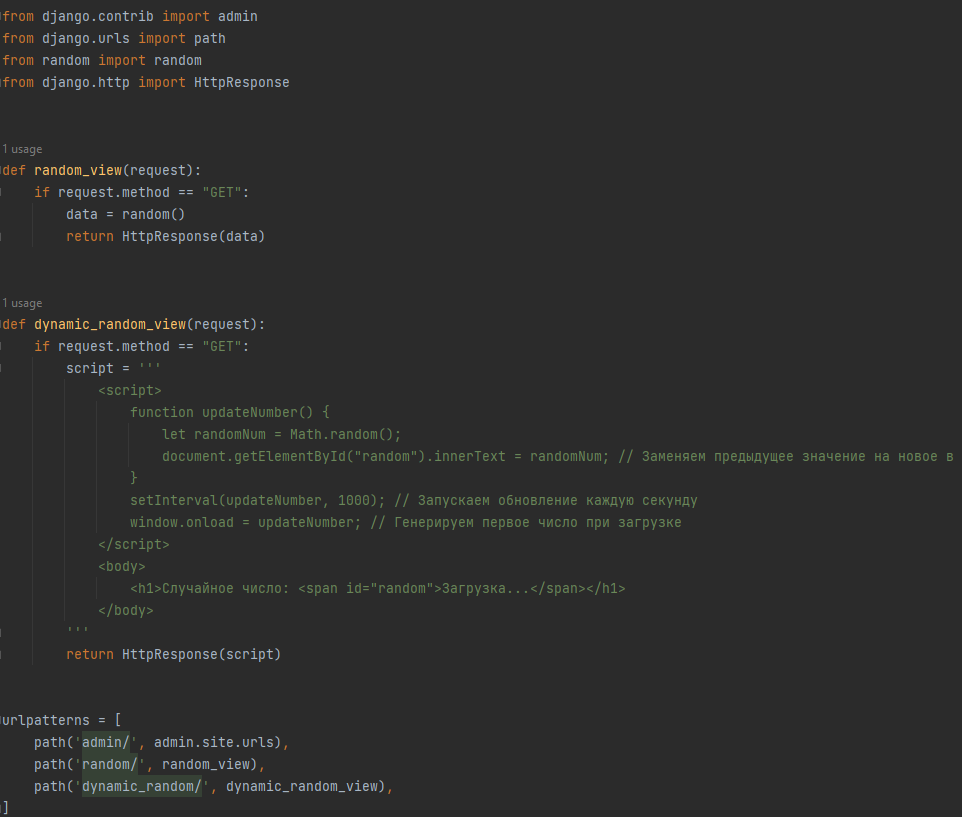
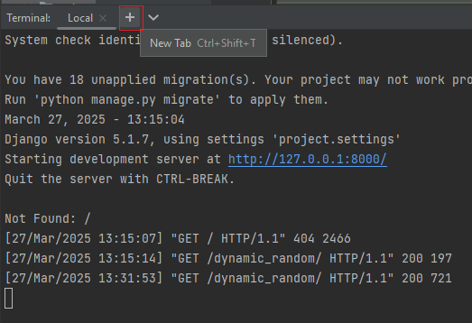
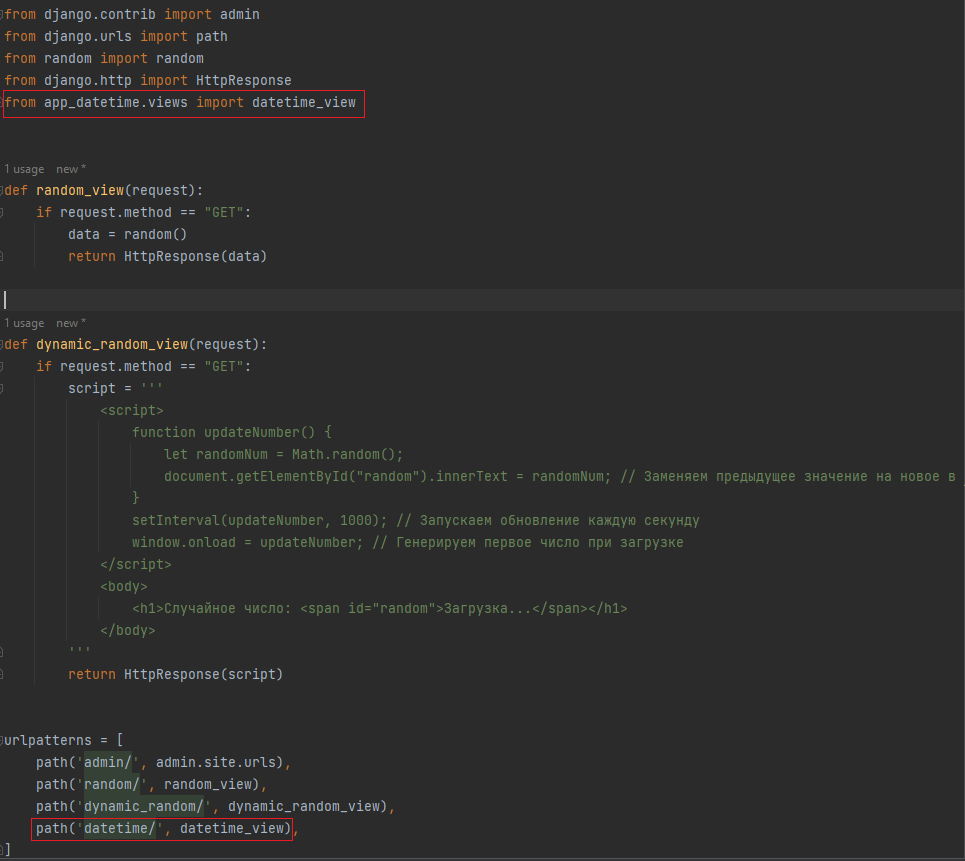
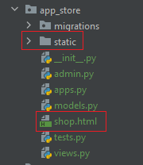
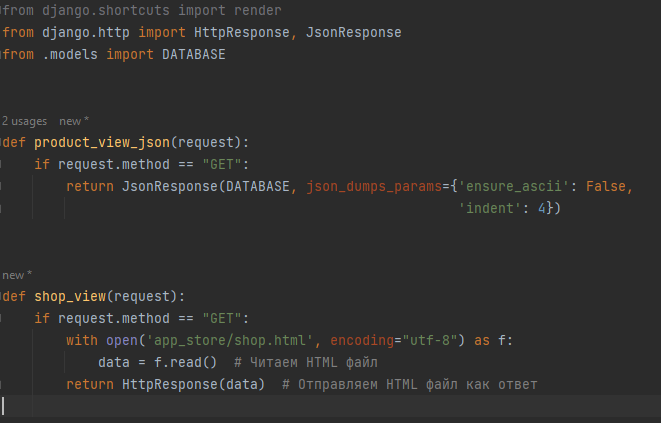
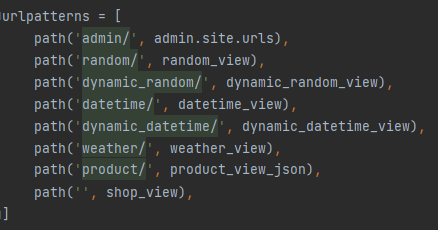

# Руководство и задания ко 2-ой практике.

На практике будем заниматься:
- созданием проекта "Магазин";
- знакомством со структурой проекта Django;
- созданием и настройкой представлений;
- созданием новых функциональных частей проекта (приложение);
- заполнением базы товаров и отображением HTML файлов Магазина.

### Раздел 1. Создание проекта

#### 1.1 Создайте проект `project` (так будет называться папка в которой создастся файлы для основного управления приложением)

В консоли пропишите команду (убедиться, что находитесь в папке проекта)

`django-admin startproject project .`

`.` ставится в конце, для создания проекта внутри корневой папки, без создания новой папки для Django приложения

#### 1.2 Исследуйте созданные файлы проекта

- Через `manage.py` происходит работа с приложением
    > Обычно в `manage.py` ничего дополнительного не прописывают.

Папка `project` содержит основные системные файлы созданного приложения:

- `asgi.py` содержит код для запуска асинхронного сервера приложений.
    > Обычно в `asgi.py` ничего дополнительного не прописывают.


- `wsgi.py` содержит код для запуска синхронного сервера приложений.
    > Обычно в `wsgi.py` ничего дополнительного не прописывают.


- `setting.py` содержит основные настройки приложения. 
    > В `setting.py` прописывают то, что изменяет поведение приложения. 
    
    > Допустим вы хотите подключить новую функциональность приложения, использовать другую базу данных, другой хостинг хранения статических данных,
добавить новое поведение обработки информации, паролей и т.д., это всё сюда в файл `settings.py`.


- `urls.py` содержит код ответственный за маршрутизацию входящих запросов.
    > В `urls.py` прописывают связи маршрутов с исполняемым кодом приложением.
    
    > Допустим вы хотите, чтобы на сайте `www.my_music_site.ru` по адресу `https://www.my_music_site.ru/my/favorites/` отобразились избранные файлы (как пример 
любимые музыкальные композиции пользователя) того пользователя, что сейчас авторизирован на сайте `www.my_music_site.ru`, тогда в `urls.py` прописывается какой маршрут будет обрабатывать 
ваше приложение, в нашем случае это маршрут `my/favorites/` и какая функция будет запускаться Python при формировании данных для ответа на запрос
в нашем случае списка файлов в избранном пользователя.


#### 1.3 Запустите сервер приложений командой в терминале

```python
python manage.py runserver
```

Если всё удачно, то зайдите на локальный хост http://127.0.0.1:8000/ , где будет развернуто ваше приложение. 
Вы увидите стартовую страницу


> Для того чтобы остановить сервер в терминале, где запустили ваш сервер, нажмите сочетание клавиш `Ctrl + C` (то же сочетание
как когда копируете в буфер обмена). Теперь ваш сервер остановлен и приложение не функционирует.

> Для того чтобы снова запустить сервер можно или снова написать команду для старта сервера или нажмите на клавиатуре стрелку вверх,
для отображения последних команд, так вы можете используя стрелки вверх, вниз посмотреть последние команды которые были запущены в данном
терминале и нажав на Enter запустить выбранную команду.

> Существует еще способ запустить сервер без написания команды для запуска сервера. Для этого:

  > - Остановите сервер;
  > - Нажмите правой кнопкой мыши на файл `manage.py` затем выберите `More Run/Debug`, затем `Modify Run Configuration...`
  > - В строке `Parameters` напишите `runserver` и нажмите OK



Теперь при запуске `manage.py` у вас будет запускаться сервер. Останавливается сервер в этом случае как и любой скрипт
нажатием на красный квадрат для остановки скрипта.

### Раздел 2. Создание представлений (функций которые возвращают данные для ответа)

Приложение выглядит совсем пустым, поэтому напишем пару представлений.

#### 2.1 Напишем представление для получения случайного числа от сервера

Так как это достаточно простое действие, то напишем его в файле `urls.py` папки `project`

В `urls.py` обычно прописывают маршруты по которым будут обрабатываться определенные представления.

В `urls.py` к стандартному коду пропишем (можно скопировать или переписать)

```python
from random import random
from django.http import HttpResponse

def random_view(request):
    if request.method == "GET":
        data = random()
        return HttpResponse(data)
```

Функция представления `ОБЯЗАТЕЛЬНО должна что-то возвращать`. Чаще всего она возвращает объект `HttpResponse` именно 
`HttpResponse` и другие объекты такие как `JsonResponse`, `FileResponse` и т.д. создают данные нужного типа для отправления
их пользователю. Функция обязательно должна принимать входной параметр `request`.

Строка `request.method == "GET"` разграничивает код отображения для выполнения запроса `GET` (вспоминаем разные типы запросов)

Однако после написания данного представления чуда не произойдёт и Django приложение ничего не обработает, так как необходимо
сказать по какому маршруту будет обрабатываться данное представление. Для этого есть в `urls.py` есть переменная `urlpatterns`,
из которой Django приложение берет информацию о маршрутах обработки представлений.

Создадим маршрут для обработки представления. Первая переменная отвечает за маршрут, а вторая за обработчик который будет 
вызван в случае совпадения маршрута

```python
path('random/', random_view),
```

Добавим маршрут к `urlpatterns`

В итоге общий код в `urls.py` будет следующим


Зайдём на http://127.0.0.1:8000/ и получим следующую картинку, где видно, что есть определенные маршруты по которым 
можно перейти 


Допишем в адресную строку `/random/` и перейдем или перейдем сразу по http://127.0.0.1:8000/random/

Теперь при обновлении страницы каждый раз будет показываться новое случайное значение.

Обратите внимание, что взаимодействие с сервером идет именно через запрос пользователя, т.е.
пользователь заходит на сайт, браузер посылается информация на сервер, на сервере обрабатывается запрос, формируется ответ и возвращается 
этот ответ в виде HTML страницы, которую браузер отображает пользователю.

Соответственно новое значение не будет отправлено сервером пока пользователь заново не отправит запрос (перезагрузит страницу).

#### 2.2 Использование кода JavaScript для динамической генерации данных на стороне пользователя

Для того чтобы разгрузить сервер от несущественных запросов, часто используют динамическую генерацию на стороне клиента с помощью JavaScript, 
так как он поддерживается всеми браузерами. Работа с JavaScript не является целью данного блока, однако он используется повсеместно в 
Web приложениях, поэтому будет не лишним немного рассмотреть основные способы его применения.

Скопируйте код нового представления в `urls.py`. Изучение JS не является целью нашего модуля, этот пример призван, чтобы 
показать динамическое обновление на стороне клиента.

```python
def dynamic_random_view(request):
    if request.method == "GET":
        script = '''
            <script>
                function updateNumber() {
                    let randomNum = Math.random();
                    document.getElementById("random").innerText = randomNum; // Заменяем предыдущее значение на новое в блоке с id="random"
                }
                setInterval(updateNumber, 1000); // Запускаем обновление каждую секунду
                window.onload = updateNumber; // Генерируем первое число при загрузке
            </script>
            <body>
                <h1>Случайное число: <span id="random">Загрузка...</span></h1>
            </body>
        '''
        return HttpResponse(script)
```
Данное представление возвращает HTML страницу с JS(JavaScript) кодом для создания и отображения случайного числа
на стороне клиента каждую секунду. Данный код будет работать даже без перезагрузки страницы, так как один раз отправив ответ от сервера,
JS код будет выполняться браузером пока не закроете страницу.

Далее добавьте в `urlpatterns`

```python
path('dynamic_random/', dynamic_random_view),
```



Теперь по маршруту http://127.0.0.1:8000/dynamic_random/ можете наблюдать динамическое обновление случайного числа без 
отправления запросов на сервер.


### Раздел 3. Cоздание функциональных частей проекта (приложение)

#### 3.1 Функционал по получению времени

Напишем представление для получения текущего времени от сервера.

Постоянно прописывать весь код в одном файле бывает удобно, до тех пор пока кода будет не слишком много, поэтому в Django
есть механизм позволяющий разделить ваше приложение на определенные изолированные папки (мини-приложения).

Воспользуемся данным механизмом и создадим приложение `app_datetime` (необязательно для этого останавливать сервер (
по команде `Ctrl+C` в консоле, где запущен сервер), можно просто нажать на `+` в терминале и вызвать новую консоль где
прописать команду)



 В терминале пропишите команду

```python
python manage.py startapp app_datetime
```

Теперь создалась папка с названием `app_datetime`

На данном этапе из `app_datetime` понадобится файл `views.py` в котором подразумевается нахождение представлений данного 
мини-приложения. 

По предложенному шаблону заполните функцию представление во `views.py`. Для получения текущей даты и времени можно вызвать метод `now` 
у `datetime`

```python
from django.http import HttpResponse
from datetime import datetime


def datetime_view(request):
    if request.method == "GET":
        data = ...  # TODO Написать, что будет возвращаться из данного представления
        return ...  # TODO Вернуть объект HttpResponse с необходимыми данными
```

Далее уже по предыдущему примеру создадим маршрут, но так как представление писали в `views.py` приложения `app_datetime`, 
то необходимо импортировать представление в `urls.py`

```python
from app_datetime.views import datetime_view
```
И создайте маршрут `datetime/`

`urls.py` выглядит следующим образом



Существует правило, что после создания приложения его необходимо зарегистировать 
в переменной `INSTALLED_APPS` файла `settings.py` папки `project`. Это необходимо
для определенных механизмов Django для работы с приложениями.


Далее через основной адрес http://127.0.0.1:8000/ можно будет посмотреть по каким маршрутам можно перейти


По маршруту http://127.0.0.1:8000/datetime/ можно будет посмотреть текущее время 

#### 3.2 Обращение к серверу через JS

Ранее на примере случайного числа было показано, что JS может запускаться в браузере непосредственно у пользователя 
без нагрузки сервера обработкой различных запросов.

Данная концепция полезна когда через JS оправленный пользователю в запросе
можно реализовать всё что нужно на стороне клиента, допустим когда нет доступа в интернет и нужно продолжать работу в Web приложении.

Однако в современных Web приложениях периодически возникает необходимость оправить запросы на сервер для различных действий, допустим 
сохранения состояния приложения на сервере и т.д., тогда JS из браузера формирует запрос на сервер по определенному маршруту, затем отправляет запрос на 
сервер, где сервер обрабатывает этот запрос, формирует ответ и отправляет браузеру пользователя обратно, где JS перехватывает этот ответ, 
обрабатывает его и далее уже говорит браузеру, что делать дальше.

Для общего развития рассмотрим данную концепцию на примере всё того же получения времени от сервера.

Сформируем новое представление, где по маршруту `dynamic_datetime/` пользователю вернется HTML с JS кодом,
который будет с определенной периодичностью (1 секунда) отправлять запрос на сервер по адресу `datetime/`, получать у сервера
текущую дату и выводить её на экран.

Во `views.py` приложения `app_datetime` создайте представление `dynamic_datetime_view`, скопируйте данный код

```python
def dynamic_datetime_view(request):
    if request.method == "GET":
        data = """
        <script>
            function updateTime() {
                fetch("/datetime/")
                    .then(response => response.text()) // Получаем HTML с сервера
                    .then(html => {
                        let parser = new DOMParser();
                        let doc = parser.parseFromString(html, "text/html");
                        let time = doc.body.innerText; // Извлекаем текст (дату и время)
                        document.getElementById("time").innerText = time;
                    })
                    .catch(error => console.error("Ошибка загрузки:", error));
            }
    
            setInterval(updateTime, 1000); // Обновление каждую секунду
            window.onload = updateTime; // Загружаем первое значение при открытии страницы
        </script>
        <body>
            <h1>Текущее время:</h1>
            <p id="time">Загрузка...</p>
        </body>
        
        """
        return HttpResponse(data)
```

Затем в корневом `urls.py` пропишите маршрут `dynamic_datetime/` с данным представлением `dynamic_datetime_view`.


Теперь перейдя по адресу http://127.0.0.1:8000/dynamic_datetime/ вы получите динамическое обновление времени за счет запросов на сервер. 
Проверить, что браузер с помощью JS действительно посылает запросы с определенной частотой можете посмотреть в терминале, где запущен сервер.
Вы увидите, что с определенной периодичностью приходят запросы, запросы будут приходить пока браузер будет поддерживать активной вкладку.

#### 3.3 Самостоятельная работа

Создайте приложение, напишите представление для отображения данных о погоде (используя ранее изученную API погоды)

Общие шаги будут следующие:

1. Создайте приложение `app_weather` с помощью команды (не забудьте указать название создаваемого приложения)
```python
python manage.py startapp
```

2. Зарегистрируйте его в `INSTALLED_APPS`.


3. Во `views.py` приложения `app_weather` создайте представление возвращающее данные о погоде. 
Используйте функцию `current_weather` написанную ранее в `weather_api.py`. 
Функцию импортируйте. В функцию передайте постоянное значение географических 
координат (в следующих практиках поправим данный момент) для предоставления информации о погоде.
Верните JSON объект и сделайте отображение кириллических символов и отступов.

    > Заполните следующий код
```python
from django.http import JsonResponse
# TODO из weather_api импортируйте функцию current_weather


def weather_view(request):
    if request.method == "GET":
        data = ...  # TODO Вызовите функцию current_weather с параметрами lat=59.93, lon=30.31
        # JsonResponse возвращаем объект JSON в качестве ответа. 
        # Параметр json_dumps_params используется, чтобы передать ensure_ascii=False
        # как помните это необходимо для корректного отображения кириллицы
        return JsonResponse(data, json_dumps_params={'ensure_ascii': False,
                                                     'indent': 4})
```

4. Зарегистрируйте маршрут `weather/` в корневом `urls.py` (тот, что в папке `project`) . 
Аналогично как для прошлого приложения.


5. Проверьте работоспособность вашего приложения как ручным методом (перейти по адресу в браузере как пример 
http://127.0.0.1:8000/weather/ ), так и с помощью модуля `requests` (как на первой практике в `Python Console`).


### Раздел 4. Работа с данными о товарах магазина

Далее сделаем возможность подключения к базе товаров нашего магазина. База оформлена в виде словаря.

1. Создадим новое приложение `app_store` (помним, что приложение создается через команду)


2. Зарегистрируйте `app_store` в `INSTALLED_APPS`.


3. В файле `models.py` приложения `app_store` сформируем базу товаров (скопируем из кода ниже и вставим в `models.py`)

```python utf-8
DATABASE = {'1': {'name': 'Болгарский перец',
                  'discount': 30,
                  'price_before': 300.00,
                  'price_after': 210.00,
                  'description': 'Сочный и яркий, он добавит красок и вкуса в ваши блюда.',
                  'rating': 4.9,
                  'review': 250,
                  'sold_value': 600,
                  'weight_in_stock': 500,
                  'category': 'Овощи',
                  'id': 1,
                  'url': 'app_store/images/product-1.jpg',
                  'html': 'bell_pepper'
                  },
            '2': {'name': 'Клубника',
                  'discount': None,
                  'price_before': 500.00,
                  'price_after': 500.00,
                  'description': 'Сладкая и ароматная клубника, полная витаминов, чтобы сделать ваш день ярче.',
                  'rating': 5.0,
                  'review': 200,
                  'sold_value': 700,
                  'weight_in_stock': 400,
                  'category': 'Фрукты',
                  'id': 2,
                  'url': 'app_store/images/product-2.jpg',
                  'html': 'strawberry'
                  },
            '3': {'name': 'Стручковая фасоль',
                  'discount': None,
                  'price_before': 250.00,
                  'price_after': 250.00,
                  'description': 'Зеленая натуральность и богатство белка для вашей здоровой диеты.',
                  'rating': 5.0,
                  'review': 100,
                  'sold_value': 500,
                  'weight_in_stock': 600,
                  'category': 'Овощи',
                  'id': 3,
                  'url': 'app_store/images/product-3.jpg',
                  'html': 'green_beans'
                  },
            '4': {'name': 'Краснокочанная капуста',
                  'discount': None,
                  'price_before': 90.00,
                  'price_after': 90.00,
                  'description': 'Удивите своих гостей экзотическим вкусом и цветом ваших блюд.',
                  'rating': 4.7,
                  'review': 30,
                  'sold_value': 50,
                  'weight_in_stock': 300,
                  'category': 'Овощи',
                  'id': 4,
                  'url': 'app_store/images/product-4.jpg',
                  'html': 'purple_cabbage'
                  },
            '5': {'name': 'Помидоры',
                  'discount': 25,
                  'price_before': 240.00,
                  'price_after': 180.00,
                  'description': 'Свежие и сочные помидоры для идеальных салатов и соусов.',
                  'rating': 4.9,
                  'review': 350,
                  'sold_value': 700,
                  'weight_in_stock': 300,
                  'category': 'Овощи',
                  'id': 5,
                  'url': 'app_store/images/product-5.jpg',
                  'html': 'tomatoes'
                  },
            '6': {'name': 'Брокколи',
                  'discount': None,
                  'price_before': 320.00,
                  'price_after': 320.00,
                  'description': 'Здоровье в каждом кусочке, чтобы укрепить вашу иммунную систему.',
                  'rating': 4.9,
                  'review': 150,
                  'sold_value': 250,
                  'weight_in_stock': 300,
                  'category': 'Овощи',
                  'id': 6,
                  'url': 'app_store/images/product-6.jpg',
                  'html': 'broccoli'
                  },
            '7': {'name': 'Морковь',
                  'discount': None,
                  'price_before': 50.00,
                  'price_after': 50.00,
                  'description': 'Красота и здоровье для ваших глаз и кожи в каждой моркови.',
                  'rating': 4.8,
                  'review': 220,
                  'sold_value': 800,
                  'weight_in_stock': 900,
                  'category': 'Овощи',
                  'id': 7,
                  'url': 'app_store/images/product-7.jpg',
                  'html': 'carrots'
                  },
            '8': {'name': 'Фруктовый сок',
                  'discount': None,
                  'price_before': 120.00,
                  'price_after': 120.00,
                  'description': 'Натуральная свежесть и энергия в каждом глотке.',
                  'rating': 4.9,
                  'review': 300,
                  'sold_value': 800,
                  'weight_in_stock': 1200,
                  'category': 'Соки',
                  'id': 8,
                  'url': 'app_store/images/product-8.jpg',
                  'html': 'fruit_juice'
                  },
            '9': {'name': 'Лук',
                  'discount': 20,
                  'price_before': 40.00,
                  'price_after': 32.00,
                  'description': 'Придайте особый аромат и вкус вашим блюдам с нашим свежим луком.',
                  'rating': 4.6,
                  'review': 80,
                  'sold_value': 170,
                  'weight_in_stock': 350,
                  'category': 'Овощи',
                  'id': 9,
                  'url': 'app_store/images/product-9.jpg',
                  'html': 'onion'
                  },
            '10': {'name': 'Яблоки',
                   'discount': None,
                   'price_before': 130.00,
                   'price_after': 130.00,
                   'description': 'Сочные и сладкие яблоки - идеальная закуска для здорового перекуса.',
                   'rating': 4.7,
                   'review': 30,
                   'sold_value': 70,
                   'weight_in_stock': 200,
                   'category': 'Фрукты',
                   'id': 10,
                   'url': 'app_store/images/product-10.jpg',
                   'html': 'apple'
                   },
            '11': {'name': 'Чеснок',
                   'discount': None,
                   'price_before': 150.00,
                   'price_after': 150.00,
                   'description': 'Секрет вкусных блюд и поддержания здоровья вашего сердца.',
                   'rating': 4.9,
                   'review': 150,
                   'sold_value': 400,
                   'weight_in_stock': 1000,
                   'category': 'Овощи',
                   'id': 11,
                   'url': 'app_store/images/product-11.jpg',
                   'html': 'garlic'
                   },
            '12': {'name': 'Перец Чили',
                   'discount': None,
                   'price_before': 400.00,
                   'price_after': 400.00,
                   'description': 'Острая страсть для тех, кто ищет приключения на своей тарелке.',
                   'rating': 5.0,
                   'review': 40,
                   'sold_value': 300,
                   'weight_in_stock': 50,
                   'category': 'Овощи',
                   'id': 12,
                   'url': 'app_store/images/product-12.jpg',
                   'html': 'chilli'
                   },
            }
```

4. Во `views.py` приложения `app_store` создадим представление `product_view_json` возвращающее все товары как объект JSON из базы данных. 


```python
from django.http import JsonResponse
from .models import DATABASE


def product_view_json(request):
    if request.method == "GET":
        return  # TODO Вернуть JsonResponse с объектом DATABASE и параметрами отступов и кодировок,
        # как в приложении app_weather
```

5. Регистрируем путь для обработчика в корневой `urls.py`, по пути `product/`


6. Проверяем работоспособность по адресу http://127.0.0.1:8000/product/ должен вернуться JSON со всеми продуктами


#### Раздел 5. Рендер HTML файлов

В папке `_labs/lab2/files` есть html документ `shop.html` приближенный к реальному html документу - это одна из страниц
шаблона магазина овощей и фруктов. Откройте этот файл через браузер или превью PyCharm.

Данный файл никак не обрабатывается Django. Пропишем представление, которое будет возвращать
этот HTML файл. Для этого:

1. Скопируем `shop.html` и папку `static` в приложение `app_store`.



2. Создадим представление, которое будет возвращать HTML шаблон.

Возвращением HTML шаблона с подставлением данных в шаблон занимается функция `render`
из `django.shortcuts` , однако, сейчас откроем html файл, считаем его и отправим в качестве ответа.

Во `views.py` приложения `app_store` пропишем

```python
from django.http import HttpResponse, JsonResponse

def shop_view(request):
    if request.method == "GET":
        with open('app_store/shop.html', encoding="utf-8") as f:
            data = f.read()  # Читаем HTML файл
        return HttpResponse(data)  # Отправляем HTML файл как ответ
```
`views.py` будет выглядеть так




3. В `urls.py` пропишите маршрут к представлению. Чтобы 
рассматриваемый HTML файл подгружался сразу при входе на сайт, то можно прописать
путь с пустой строкой, такой как

```python
path('', shop_view),
```



4. Проверьте, что всё отрабатывает корректно при входе на главную страницу сайта.

Страница должна выглядеть так


# Практика окончена

Зафиксируем изменения сделав коммит и отправим эти коммиты на github