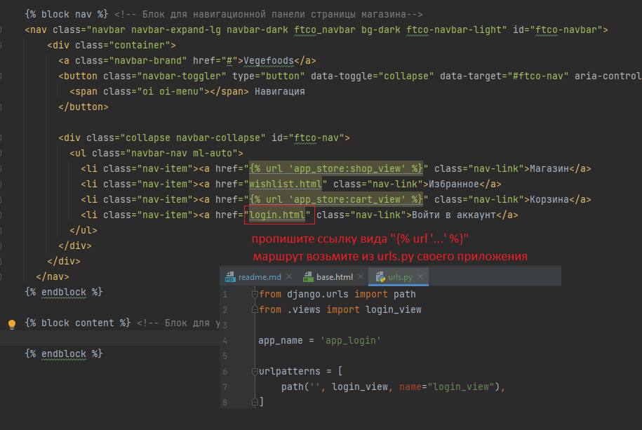
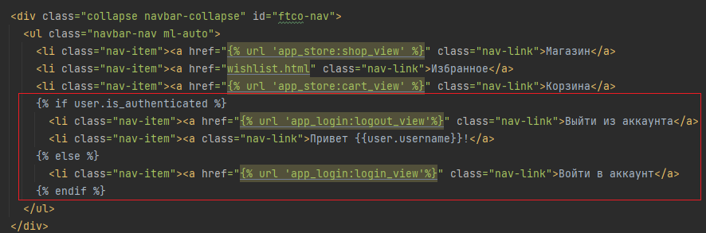
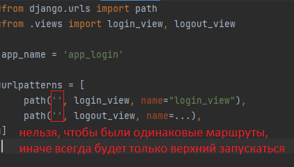
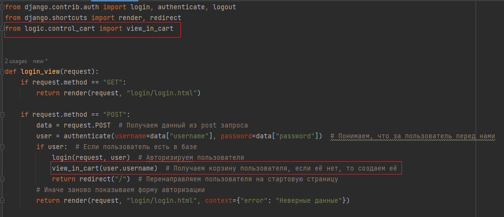
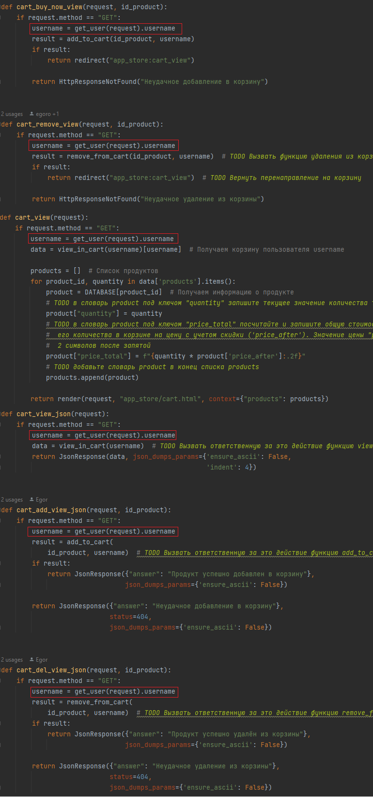
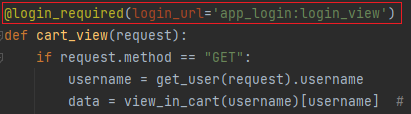

# Руководство и задания к 5-ой практике. 

На практике поработаем с функционалом корзины, произвёдем регистрацию пользователей и
напишем авторизационную часть. 

### Раздел 1. Работа с корзиной

Ранее мы реализовали отображение корзины, теперь реализуем определенный функционал в данной корзине.

#### 1.1 Реализация проверки действия купона

Поступил запрос на разработку функционала проверки купона со стороны сервера для применения его к стоимости заказа.

Необходимо реализовать обработчик, который возвращает JSON с данными действителен ли купон и процент скидки 
со стоимости товара.

*Как всё работает на стороне клиента?*

Работа построена на javascript обработчике со стороны клиента, который отравляет `GET запрос` на адрес `http://127.0.0.1:8000/coupon/check/<name_coupon>` , где
`<name_coupon>` код купона, получаемый из HTML формы. Javascript обработчик получает JSON со стороны сервера и проверяет поля
`"is_valid"` и `"discount"`. 

* Если `"is_valid"` равно `True` значит купон действительный и можно посмотреть какой у него размер скидки `"discount"`,
после применения купона произойдет пересчет общей стоимости заказа с учетом скидки и под кнопкой проверить появится надпись `f'Купон действителен! Размер скидки: {discount} %'`.

* Если `"is_valid"` равно `False`, то под кнопкой проверить появится надпись `'Купон не действителен!'`

* Если в JSON вернётся ошибка, то обработчик воспримет, что данного купона не существует и под кнопкой проверить появится 
надпись `'Произошла ошибка при проверке купона'`

Всё что описано, не нужно реализовывать, это уже есть на стороне клиента.

*Что необходимо сделать нам?*

Нам необходимо написать представление, которое обработает входящий запрос и вернёт JSON с ключами `"is_valid"` и `"discount"`,
если такой купон есть в базе, а если его нет то вернет объект `HttpResponseNotFound("Неверный купон")`.

Заполните представление `coupon_check_view` в `views.py` приложения `app_store`, и доведите его до рабочего состояния

```python
def coupon_check_view(request, name_coupon):
    # DATA_COUPON - база данных купонов: ключ - код купона (name_coupon); значение - словарь со значением скидки в процентах и
    # значением действителен ли купон или нет
    DATA_COUPON = {
        "coupon": {
            "discount": 10,
            "is_valid": True},
        "coupon_old": {
            "discount": 20,
            "is_valid": False},
    }
    if request.method == "GET":
        ...  # TODO Проверьте, что name_coupon есть в DATA_COUPON среди ключей, если он есть, то верните JsonResponse в котором по ключу "discount"
        # получают значение скидки в процентах, а по ключу "is_valid" понимают действителен ли купон или нет (True, False)

        # TODO Если купона нет в базе, то верните HttpResponseNotFound("Неверный купон")
```

Представление должно обрабатываться по маршруту 

```
coupon/check/<slug:name_coupon>
``` 

в `urls.py` приложения `app_store`

Проверить работу можно по маршруту 

http://127.0.0.1:8000/coupon/check/coupon


А в корзине покупок при применении промокода появится следующее.


#### 1.2 Реализация расчёта стоимости доставки

Поступил запрос на разработку функционала расчёта стоимости доставки со стороны сервера для применения данной стоимости 
к стоимости заказа.

Здесь всё, как и в прошлый раз работает javascript, а нам необходимо реализовать обработку запросов.

В этот раз на стороне клиента происходит GET запрос c параметрами по адресу `http://127.0.0.1:8000/delivery/estimate?country=<country>&city=<city>&code=<code>`,
`<country>`, `<city>` и `<code>` - страна, город и почтовый код для доставки соответственно.

На стороне клиента ожидается возвращения JSON с ключом `"price"` значение которого будет соответствовать стоимости доставки.

Если по какой-то причине нельзя рассчитать стоимость доставки, то верните `HttpResponseNotFound("Неверные данные")`

Предлагается заполнить представление `delivery_estimate_view` возвращающее JSON

```python
def delivery_estimate_view(request):
    # База данных по стоимости доставки. Ключ - Страна; Значение словарь с городами и ценами; Значение с ключом fix_price
    # применяется если нет города в данной стране
    DATA_PRICE = {
        "Россия": {
            "Москва": {"price": 90},
            "Санкт-Петербург": {"price": 78},
            "fix_price": 100,
        },
    }
    if request.method == "GET":
        data = request.GET
        country = data.get('country')
        city = data.get('city')
        # TODO Реализуйте логику расчёта стоимости доставки, которая выполняет следующее:
        # Если в базе DATA_PRICE есть и страна (country) и существует город(city), то вернуть JsonResponse со словарём, {"price": значение стоимости доставки} 
        # Если в базе DATA_PRICE есть страна, но нет города, то вернуть JsonResponse со словарём, {"price": значение фиксированной стоимости доставки} 
        # Если нет страны, то вернуть HttpResponseNotFound("Неверные данные")
```

Представление должно обрабатываться по маршруту `delivery/estimate` в `urls.py` приложения `app_store`

Проверить работу можно по маршруту 

* http://127.0.0.1:8000/delivery/estimate?country=Россия


* http://127.0.0.1:8000/delivery/estimate?country=Россия&city=Санкт-Петербург

* http://127.0.0.1:8000/delivery/estimate?country=Россия&city=Томск

* http://127.0.0.1:8000/delivery/estimate?country=Беларусь&city=Минск

А в корзине покупок при расчёте доставки появится следующее.


#### 1.3 Добавление продуктов в корзину

##### 1.3.1 Добавление без перехода в корзину

На самом деле добавление в корзину уже реализовано в `shop.html` с использованием JS кода, однако для кооректной работы
необходимо, чтобы в свойстве `data-product-id` содержался правильный id товара, который будет добавляться в корзину.

В `shop.html` найдите свойство `data-product-id` отвечающее за идентификацию выпадающего меню товара и произведите изменения
на `data-product-id={{product.id}}`


Теперь при добавлении товаров в корзину по нажатии на иконку товар добавится в корзину


Теперь если всё сделано верно, то при нажатии на добавления товара на главной странице появится всплывающее окно,
а товар будет добавлен в корзину.

##### 1.3.2 Добавление товара с переходом в корзину

Реализуем аналогичную функциональность средствами Django.

Что сделаем:

* Создадим представление для обработки запроса на добавление

Для этого используем метод `redirect`, который перенаправляет наш запрос на другой обработчик.
В нашем случае на обработчик занимающийся показом корзины (маршрут `/cart/`)

Во `views.py` приложения `app_store` создадим представление `cart_buy_now_view`, но предварительно импортируем метод `redirect`

```python
from django.shortcuts import redirect
```

```python
def cart_buy_now_view(request, id_product):
    if request.method == "GET":
        username = ''
        result = add_to_cart(id_product, username)
        if result:
            return redirect("app_store:cart_view")

        return HttpResponseNotFound("Неудачное добавление в корзину")
```
Почему мы возвращаем `redirect` на обработчик корзины? Это сделано для уменьшения дублирования кода,
то есть мы делегируем полномочия на другой обработчик. 

Это означает, что после обработке маршрута, мы добавим в корзину, а далее мы не останемся на данном маршруте,
а просто перейдём по маршруту который отображает корзину, так пользователь 
не будет видеть лишние действия со стороны сервера.

* Зарегистрируем маршрут по пути `cart/buy/<str:id_product>` с именованием `"buy_now"`

```python
path('cart/buy/<str:id_product>', cart_buy_now_view, name="buy_now"),
```

* Пропишите обработчик к специальной ссылке в `shop.html` 

```html
href=""
```

Место для ссылки находится рядом с той кнопкой добавления, можно найти по `class="buy-now d-flex justify-content-center align-items-center mx-1"`


Теперь при нажатии на добавление товара с переходом в корзину, происходит ровно то, что и требовалось


##### 1.3.3 *Дополнительно*

Выше в обработчике `cart_buy_now_view` использовали редирект, но что если передать туда просто вызов другого обработчика,
изменится ли что-то или нет?

Посмотрите разницу между двумя подходами в обработчике `cart_buy_now_view`, когда возвращаем функцию представление,
вместо перенаправления `redirect("app_store:cart_view")` вернем `cart_view(request)`

```python
def cart_buy_now_view(request, id_product):
    if request.method == "GET":
        username = ''
        result = add_to_cart(id_product, username)
        if result:
            return cart_view(request)

        return HttpResponseNotFound("Неудачное добавление в корзину")
```

Проанализируйте, что изменилось. 

После анализа верните обратно `redirect("app_store:cart_view")`, так как данный 
механизм чаще используют.


##### 1.3.4 Удаление продуктов из корзины

С вопросами добавления мы разобрались, но удаление из корзины через адресную строку всё так же неудобно.

Если заглянуть в корзину, то у товаров можно заметить одну особенность, это крестик рядом с картинкой товара.


На крестик можно нажать, но ничего не произойдёт. Используем его для вызова обработчика и удаления позиции из корзины.

Реализуйте самостоятельно механизм удаления из корзины, следуя шагам:

* Реализуйте представление `cart_remove_view`, оно очень похоже на `cart_buy_now_view`, только с уклоном на удаление, а не добавление.

Посмотрите при помощи какой функции вы удаляли продукт из корзины в представлении `cart_del_view` когда работали с JSON.
Используйте эти знания для реализации `cart_remove_view`

``````python
def cart_remove_view(request, id_product):
    if request.method == "GET":
        username = ''
        result = ...  # TODO Вызвать функцию удаления из корзины 
        if result:
            return ...  # TODO Вернуть перенаправление на корзину

        return HttpResponseNotFound("Неудачное удаление из корзины")
``````

* Настройте маршрут на путь `cart/remove/<str:id_product>` и именование маршрута `"remove_now"`

```python
path('cart/remove/<str:id_product>', cart_remove_view, name="remove_now"),
```

* Пропишите обработчик в `cart.html` используя тег `` 
(аналогично как для добавления в корзину с переходом)


Если всё верно прописано, то при нажатии на крестик, будет вызван переход по нужному маршруту,
затем вызван обработчик `cart_remove_view` который перенаправит на отображение корзины после 
удаления товаров из корзины.

Проверьте работоспособность данной функциональности.


### Раздел 2. Работа с авторизацией

Вроде бы уже сделано многое, а авторизации на сайте у нас нет, хотя в навигационной панели есть переход к форме авторизации.

Представлений в нашем приложении store большое количество, уже сложно следить за каждым из них, давайте создадим отдельное приложение для
авторизации и регистрации. 

На практике типовые приложения Django для интернет-магазина продуктов могут включать:

* `Каталог`: для управления продуктами, категориями и тегами.
* `Корзина`: для управления выбранными пользователем продуктами.
* `Заказы`: для управления информацией о заказах и статусах.
* `Платежи`: для обработки платежей и интеграции с платежными шлюзами.
* `Аутентификация и авторизация`: для управления пользователями и входом в систему.
* `Уведомления`: для отправки уведомлений пользователям о статусе заказа и другой информации.

#### 2.1 Настройка приложения для авторизации

Сделаем ряд действий:

1. Создадим новое приложение `app_login` воспользовавшись командой 

```python 
python manage.py startapp app_login
```

2. Зарегистрируем приложение в `settings.py` в списке `INSTALLED_APPS`

3. В приложении создадим папки `static` и `templates`, а в них папку `login`(чтобы чуть сократить название,
хотя по обычаю создавали папку с названием приложения)

4. Скопируем данные в `app_login/static/login` из `_labs/lab5/files/static`, а в `app_login/templates/login` скопируйте 
файл `login.html` из `_labs/lab5/files/`. Также в `app_login` скопируйте с заменой файлы `views.py` и `urls.py` из
`_labs/lab5/files`.

В итоге `app_login` будет выглядеть так


5. В корневом `urls.py` папки `project` пропишем маршрут до приложения `app_login`

```python
path('login/', include('app_login.urls')),
```

6. Для удобства пропишем ссылку в навигационной панели в `base.html` (приложение `app_store`) на форму авторизации

Самостоятельно пропишите ссылку, посмотрите какой маршрут вызывает отображение авторизационной формы.



7. Проверьте, что при нажатии на "Войти в аккаунт" на главной странице, происходит переход на форму авторизации.

#### 2.2 Регистрация пользователя

Зарегистрируем пользователя. На текущий момент не будем заниматься созданием своей базы пользователя, 
а оставим это на механизмы Django.

В Django есть механизм позволяющий регистрировать администраторов в системе. Администратор, это пользователь 
наделённый максимальными правами в системе, но так как, это пользователь, поэтому мы и используем этот механизм.

Перед регистрацией воспользуемся командой для формирования всех таблиц в системной базе данных Django, 
это необходимо для последующего создания пользователя в базе Django.

В терминале выполните команду
```python
python manage.py migrate
```
В консоле можно увидеть, что создались определенные системные таблицы для хранения информации.

Для регистрации воспользуемся командой 

```python
python manage.py createsuperuser
```
Далее вам предстоит придумать логин, допустим `admin`. 

Графу `Email address` можно оставить пустой.

Затем нужно придумать пароль, пароль может быть очень простой. Внимание при вводе пароля, пароль не будет отображаться в консоле,
не пугайтесь этого, это один из способов защиты при вводе пароля. Допустим можно в качестве пароля использовать `123`

Затем повторите ваш набранный ранее пароль.

Если пароль будет слабый по защите, то появится вопрос, про вашу уверенность в создании такого слабого пароля. Введите английскую `y`


Затем ваш пользователь будет создан. Но не будет авторизован в системе, т.е. сервер не понимает, что именно данный пользователь
сейчас на сайте.

Давайте авторизуемся под этим пользователем.

#### 2.3 Аутентификация и авторизация пользователя

У Django есть специальный механизм по аутентификации (механизм узнавания пользователя) 
и авторизации(механизм определения пользователя в системе).

У нас есть `login.html` который предоставляет форму авторизации по логину и паролю. Используем его для наших нужд. 
Данная форма уже настроена так, что будет отправлять post запросы на свой же адрес в сети, такой подход часто используется на практике.

Эти уже пройти прописаны в `login.html`
```html
action="." method="post"
```


Так как пароль всё же закрытая информация, то передавать всё будем в методе POST, поэтому в форме прописан `post` метод.
А `action="."`, что отправляем на свой же адрес, просто тем методом, что объявлен в `method`.

Также необходимо добавить токен `` (уже добавлен в форму, дополнительно делать ничего не нужно). 
Django старается при обработке POST запросов проверить 
защищенность формы от подмены элементов формы, для этого есть механизм CSRF токенов в Django.


Затем воспользуемся встроенными функциями `authenticate` и `login` из `django.contrib.auth`

Во `views.py` приложения `app_login` пропишем 

```python
from django.contrib.auth import login, authenticate, logout
from django.shortcuts import render, redirect


def login_view(request):
    if request.method == "GET":
        return render(request, "login/login.html")

    if request.method == "POST":
        data = request.POST  # Получаем данный из post запроса
        user = authenticate(username=data["username"], password=data["password"])  # Понимаем, что за пользователь перед нами
        if user:  # Если пользователь есть в базе
            login(request, user)  # Авторизируем пользователя
            return redirect("/")  # Перенаправляем пользователя на стартовую страницу
        # Иначе заново показываем форму авторизации
        return render(request, "login/login.html", context={"error": "Неверные данные"})
```

Логика тут следующая:
* Из запроса мы получаем информацию(`request.POST`), ту что передали в форму


* Затем мы проводим проверку, что данный пользователь существует при помощи `authenticate`, если пользователь есть в базе Django,
то он вернется, если нет, то вернется `None`


* Если пользователь существует, то при помощи функции `login` мы авторизуем пользователя в системе и перенаправляем на главную страницу.


* Если пользователя не существует или были введены ошибочные данные, то отправляем на страницу авторизации с текстом "Неверные данные".
В `login.html` уже прописан параметр `{{error}}` для возможности отображения ошибок в форме при рендринге. 

Теперь пользователь явно авторизован.

#### 2.4 Отображение авторизированного пользователя в шапке страницы

Пользователь авторизирован, но не понятно какой именно пользователь авторизирован.

Для этого в навигационную панель шаблона `base.html` добавим пару строк

Вместо 
```html
<li class="nav-item"><a href="" class="nav-link">Войти в аккаунт</a>
```

Поставим 

```html

<li class="nav-item"><a href="" class="nav-link">Выйти из аккаунта</a>
<li class="nav-item"><a class="nav-link">Привет {{user.username}}!</a>

<li class="nav-item"><a href="" class="nav-link">Войти в аккаунт</a>

```



Мы видим, что добавлена строка "Выйти из аккаунта" и тег `` который будет требовать обработчика. 

Вам необходимо самостоятельно дописать функцию представление в `views.py` приложения `app_login` и прописать маршрут 
зайдя на который можно будет разлогиниться.

1. Используйте шаблон ниже для функции представления

```python
def logout_view(request):
    if request.method == "GET":
        logout(request)  # Функция разлогинивает пользователя
        return ... # TODO Верните редирект на стартовую страницу
```

2. Зарегистрируйте маршрут исходя из требований тега ``

> Важная информация! Нельзя чтобы маршруты назывались одинаково, так как тогда всегда будет запускаться тот, 
> что объявлен раньше. Поэтому разделите маршруты, допустим для представления logout_view пропишите маршрут `logout/`, не забудьте правильно 
> прописать название маршрута в параметре `name`



Теперь если зайти на главную страницу будет показываться имя пользователя, 
пропадет кнопка авторизации, так как пользователь авторизирован, а появится кнопка выхода из аккаунта (если правильно прописали маршрут и представление)


3. Зарегистрируйте новый аккаунт через 
```python 
python manage.py createsuperuser
```

4. Разлогиньтесь и авторизируйтесь под другим аккаунтом. 

#### 2.5 Связь пользователя и корзины

Теперь нужно подправить работу с корзиной, так как при переходе в корзину конкретный пользователь 
не связан с корзиной. У нас была описана абстрактная корзина для пользователя `username = ''`.

для того, чтобы определить что у нас за пользователь авторизирован в системе в Django есть функция `get_user` из `django.contrib.auth`  

Главное, что нам необходимо добавить
это определение текущего пользователя в системе.

Для этого воспользуемся функцией `get_user`
```python
from django.contrib.auth import get_user
```
Для работы `get_user` необходимо на вход подать `request`, так как в функциях представлениях 
необходимо будет знать какой пользователь сейчас в магазине.

Теперь осталось определиться, в какой момент будет добавляться пользователь в базу данных корзины. 
При процедуре регистрации или авторизации Django это не предусматривает создание каких либо элементов дял пользователя,
Django работает только с пользователем. 
В зависимости от поставленных задач корзина для пользователя может создаться как при регистрации, так и при авторизации пользователя.
В нашем случае выберем вариант создания корзины при авторизации пользователя. 

Ранее когда создавали различные функции в `logic/control_cart.py`, то в функции `view_in_cart` уже есть возможность проверить 
конкретного пользователя в базе `cart.json` и если его нет, то ему будет создана пустая корзина, чем и воспользуемся.

В приложении `app_login` во `views.py` в отображении `login_view` вызовем `view_in_cart` после авторизации пользователя,
таким образом мы проверим наличие корзины для пользователя.

```python
from logic.control_cart import view_in_cart
```

```python
view_in_cart(user.username)  # Получаем корзину пользователя, если её нет, то создаем её
```



Логику создания корзины пользователя мы настроили. Теперь осталось во `views.py` приложения `app_store` в каждом месте, где передаётся пользователь 
в функции `view_in_cart`, `add_to_cart`, `remove_from_cart` вместо `username = ''` поставить `username = get_user(request).username`

```python
from django.contrib.auth import get_user

# было
username = ''
# стало
username = get_user(request).username
```

Проведите данные замены пользователя для следующих представлений связанных с корзиной:
* `cart_buy_now_view`
* `cart_remove_view`
* `cart_view`
* `cart_view_json`
* `cart_add_view_json`
* `cart_del_view_json`

Тогда код в `views.py` приложения `app_store` будет выглядеть 


Теперь у нас появилась возможность просматривать корзину авторизированного пользователя. Проверьте, что функциональность
нашего магазина не изменилась. Авторизируйтесь по разными пользователями, добавьте разные продукты, разными способами. Проверьте, что
у разных пользователей сохраняются их корзины.

#### 2.6 Ограничение доступа к определенным частям сайта неавторизированным пользователям

Если выйти из аккаунта пользователя, то при добавлении в корзину или при просмотре корзины, мы также можем делать всё то,
что и для авторизированного пользователя. Давайте разграничим доступ к корзине, чтобы только авторизированный пользователь мог добавить
или просмотреть корзину, иначе приложение будет требовать пройти авторизацию.

Реализуем механизм ограничения доступа к определенным действиям на сайте для неавторизированного пользователя.

Механизм ограничения доступа будем реализовываться при помощи декоратора `@login_required` из `django.contrib.auth.decorators`

Применим декоратор на функцию `cart_view` приложения `app_store`.

```python
from django.contrib.auth.decorators import login_required
```

```python
@login_required(login_url='app_login:login_view')
```



Теперь если пользователь не авторизирован, то при переходе на корзину - пользователя перенаправят на форму авторизации. 
Т.е. при любом вызове обработчика, показывающего корзину, теперь будет требоваться авторизация.

Добавим декоратор `@login_required(login_url='app_login:login_view')` на соответствующие остальные обработчики связанные с корзиной:

* `cart_buy_now_view`
* `cart_remove_view`
* `cart_view_json`
* `cart_add_view_json`
* `cart_del_view_json`

Теперь всё должно работать корректно. Проверьте функционал, что товар добавляется в корзину только авторизированным пользователем. 
При этом просмотр товаров можно осуществлять неавторизированным пользователям.

### Практика окончена

Зафиксируем изменения (если хотите, то можете добавить файл базы данных db.sqlite3 в систему контроля версий) сделав коммит и отправим эти коммиты на github